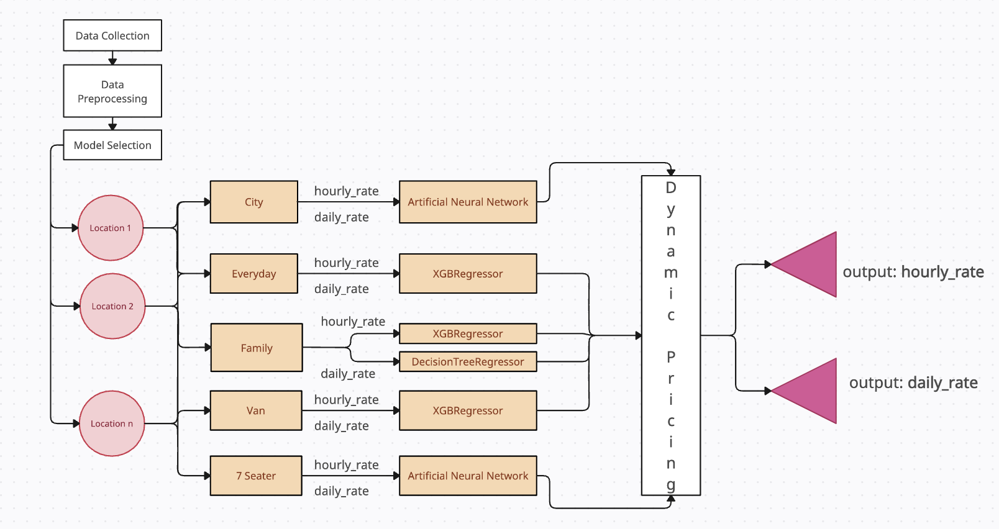
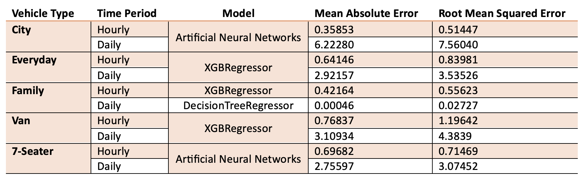
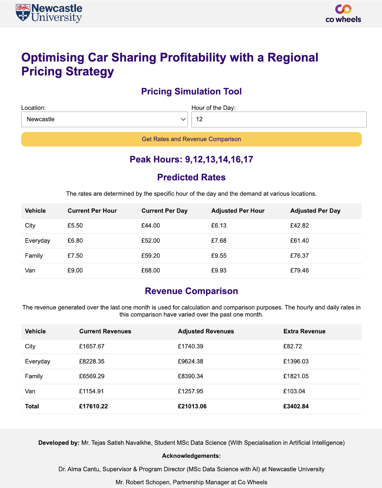

# Title: Optimising Car Sharing Profitability with a Regional Pricing Strategy

## Description

This research aims to optimise the profitability of Co Wheels, a UK-based car-sharing service, through the development and implementation of a dynamic pricing strategy. By addressing the inherent challenges of a uniform pricing model in a competitive and seasonally variable market, the study seeks to enhance financial sustainability while promoting sustainable transportation. Utilising historical booking data from January 2019 to April 2024, machine learning models, including Artificial Neural Networks, XGBoost Regressors, and Decision Tree Regressors, were trained to predict hourly and daily rates for various vehicle types. Key demand factors such as peak hours, seasonality, and location popularity were integrated into these models. A web-based simulation tool was developed to display adjusted hourly and daily rates based on location and time of day, and to visualise their impact on profitability over the past month. The results demonstrated a significant improvement in revenue generation, with adjusted pricing strategies outperforming static rates by 19.32% in test scenarios. This dynamic pricing approach not only boosts Co Wheels' profitability but also supports its mission to reduce carbon emissions and encourage shared vehicle use over private car ownership. The study highlights the potential of advanced machine learning techniques in optimising pricing strategies and sets the stage for future enhancements incorporating real-time data sources, such as economic indicators and weather conditions, as well as exploring adaptive pricing mechanisms and dynamic fleet allocation to further enhance predictive accuracy and operational efficiency.


## Installation

The installation begin by cloning this repository. All dependencies are stored in the [requirements.txt file](requirements.txt).


```terminal

git clone https://github.com/tejasnavalkhe/Optimising-Car-Sharing-Profitability-with-a-Regional-Pricing-Strategy.git "Optimising Car Sharing Profitability with a Regional Pricing Strategy"
cd Optimising Car Sharing Profitability with a Regional Pricing Strategy
pip install -r requirements.txt
```


## Usage

```terminal

python app.py
```


## Screenshots

1. Project Flow Diagram:


2. Models Errors:


3. Pricing Simulation Tool Results


4. Comparison of Last One Month Actual and Adjusted Revenues - Newcastle:


## Contact Information

<h3 align="left">📫 Connect with me:</h3>
<p align="left">
<a href="https://linkedin.com/in/tejasnavalkhe" target="blank"></a>
<a href="https://instagram.com/tejasnavalkhe" target="blank"></a>
<a href="https://fb.com/tejasnavalkhe1810" target="blank"></a>
<a href="https://twitter.com/tejasnavalkhe" target="blank"></a>
</p>


## Future Work

1. **Incorporating Real-Time Data Sources**: Use real-time data like social media trends, economic indicators, competitor pricing, weather conditions, and local events to provide a comprehensive view of factors influencing demand and improve accuracy.
2. **Adaptive Pricing Mechanisms**: Develop adaptive mechanisms to adjust pricing strategies based on real-time feedback and changing market conditions.
3. **Exploring Additional Machine Learning Techniques**: Investigate techniques such as ensemble methods and reinforcement learning to improve model accuracy and adaptability. Ensemble methods combine multiple models for robust predictions, while reinforcement learning develops strategies for dynamic environments.
4. **Dynamic Fleet Allocation**: Use algorithms to allocate vehicles based on real-time demand, ensuring availability and improving efficiency and satisfaction.


### Note:

The dissertation project is a component of my master's degree in MSc Data Science (Specialisation in Artificial Intelligence). I served as a Data Scientist Intern at Co Wheels Car Club from April 23, 2024, to August 15, 2024.
